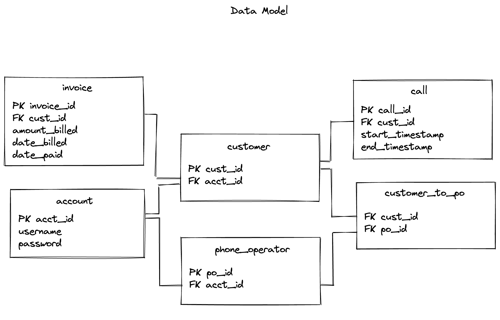

# Phone Billing Service
This microservice is built to implement a very simple phone billing system.

## Requirements:
* Receive number of minutes for each customer call.
* Provide the call history by user.
* Calculate the period total and generate the invoice for a customer.
* Must have a database where call history and invoices are stored.

## Use Cases:
* As a phone operator I want all my customer calls to be charged.
* As a customer I want to be able to see my phone call history.
* As a customer I want to receive my invoice every first day of the month.

## Getting Started

### Installing Dependencies

#### Virtual Environment
* To create virtual environment: `python -m venv venv`
* Activate virtual environment: `source venv/bin/activate`

#### PIP Dependencies
* Install dependencies: `python -m pip install -r requirements.txt`

#### Running the server
* To initiate database using `initialize_db.py` for testing purposes: `flask init-db`
* To run: `flask run`
* To access database initiated from first step: `sqlite3 app/test.db`
* To run tests: `pytest`

## Models


## Endpoints
[Click here](postman_collection.json) for collection of requests.

### Index
```
GET '/'
```
* Returns the detail.html template.

### Call
```
GET '/call'
```
* Get all calls for all customers.
* `/call` is registered as a bluprint.

#### Get Call History
```
GET '/call/customer'
```
* Get the call history by customer id.
* Send formdata.
```
"body": {
        "mode": "formdata",
        "formdata": [
            {
                "key": "customer",
                "value": "1",
                "type": "default"
            }
        ]
    }
```

#### Add Call By Minutes
```
POST '/call/add_call'
```
* Post incoming call with customer id and minutes.
* Send formdata.
```
"body": {
        "mode": "formdata",
        "formdata": [
            {
                "key": "customer",
                "value": "2",
                "type": "default"
            },
            {
                "key": "minutes",
                "value": "20",
                "type": "default"
            }
        ]
    }
```
* After adding a new call call history response gets returned.

### Invoice
```
GET '/invoice'
```
* Get all invoices for all customers.
* `/invoice` is registered as a bluprint.

#### Get Invoice History
```
GET '/invoice/customer'
```
* Get the invoice history by customer id.
* Send formdata.
```
"body": {
        "mode": "formdata",
        "formdata": [
            {
                "key": "customer",
                "value": "1",
                "type": "default"
            }
        ]
    }
```

#### Get Consolidated Invoice per Month by Customer
```
GET '/invoice/consolidated'
```
* Get consolidated invoice per month for specific customer id.
* Send formdata.
```
"body": {
        "mode": "formdata",
        "formdata": [
            {
                "key": "customer",
                "value": "1",
                "type": "default"
            }
        ]
    }
```

#### Get Specific Month Invoice by Customer
```
GET '/invoice/month'
```
* Get specific month invoice for customer id.
* Send formdata.
```
"body": {
        "mode": "formdata",
        "formdata": [
            {
                "key": "customer",
                "value": "1",
                "type": "default"
            },
            {
                "key": "month",
                "value": "9",
                "type": "default"
            }
        ]
    }
```

#### Generate Invoice
```
POST '/invoice/generate_invoice'
```
* Customers receive invoice every first day of the month.
* Invoice is calculated from last month's usage
* If today is not the first day of the month, it redirects to current month's usage.
* Send formdata.
```
"body": {
        "mode": "formdata",
        "formdata": [
            {
                "key": "customer",
                "value": "1",
                "type": "default"
            }
        ]
    }
```

## Scalability

### Support different billing plans
* Billing plan options: prepaid, fixed amount.
* Add billing_plan to Customer model.
* Operator model is added to support customers with different billing plans.
* Invoice logic can be reused with a check for prepaid. If prepaid, it will have an invoice of prepaid amount.

### Account, Customer, Operator Relationship
* Both Customer model and Operator model is related to Account model.
* po_to_cust table is created for easier usability since this way operators can be linked with multiple customers and vice versa for customers.
